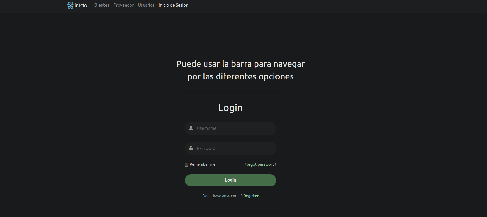
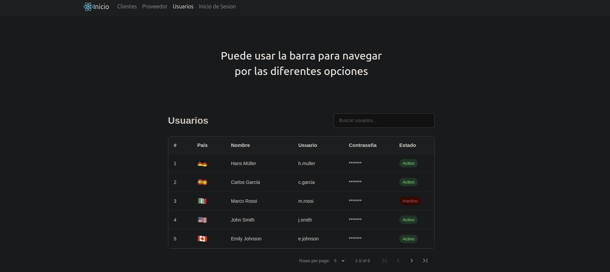
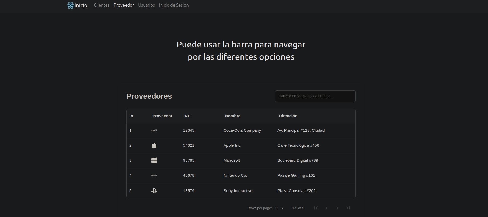
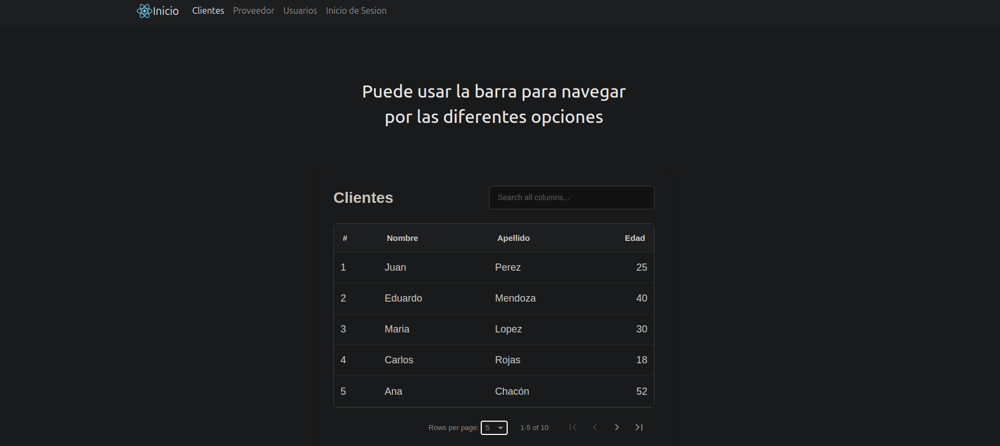

# Panel Administrativo con React






## Descripción 📝

Panel administrativo web desarrollado con React que incluye módulos para gestionar:
- **Clientes** (Nombre, Apellido, Edad)
- **Proveedores** (Icono, NIT, Nombre, Dirección)
- **Usuarios** (País, Nombre, Usuario, Estado)

## Características principales ✨

- Interfaz moderna con diseño responsive
- Tablas interactivas con paginación y búsqueda
- Navegación entre secciones sin recargar la página
- Iconos representativos para proveedores y usuarios
- Estados visuales (activo/inactivo)

## Tecnologías utilizadas 🛠️

- **Frontend**:
  - React 18
  - Vite
  - React Router (v6)
  - React Icons
  - react-data-table-component (para tablas)
  - CSS moderno (Flexbox, variables CSS)
  
## Instalación y configuración ⚙️

1. **Clonar el repositorio**:
 ```bash
 git clone https://github.com/Kevin2211875/Taller_React_Kevin_Guzman.git
 ```
2. **Instalar dependencias**:

  ```bash
  npm install
  ```
  
  ```bash
  npm install react-data-table-component styled-components
  ```
  
  ```bash
  npm install react-icons
  ```
3. **Variables de entorno**:

  ```bash
  VITE_API_URL=http://localhost:3000
  ```

4. **Ejecutar en desarrollo**:

  ```bash
  npm run dev
  ```

## Estructura del proyecto 📂
  ```bash
  src/
  ├── components/
  │   ├── Navbar.jsx
  │   └── ...
  ├── pages/
  │   ├── Clientes/
  │   │   ├── Clientes.jsx
  │   │   └── Clientes.css
  │   ├── Proveedores/
  │   │   ├── Proveedores.jsx
  │   │   └── Proveedores.css
  │   └── Usuarios/
  │       ├── Usuarios.jsx
  │       └── Usuarios.css
  ├── App.jsx
  └── main.jsx
  ```
